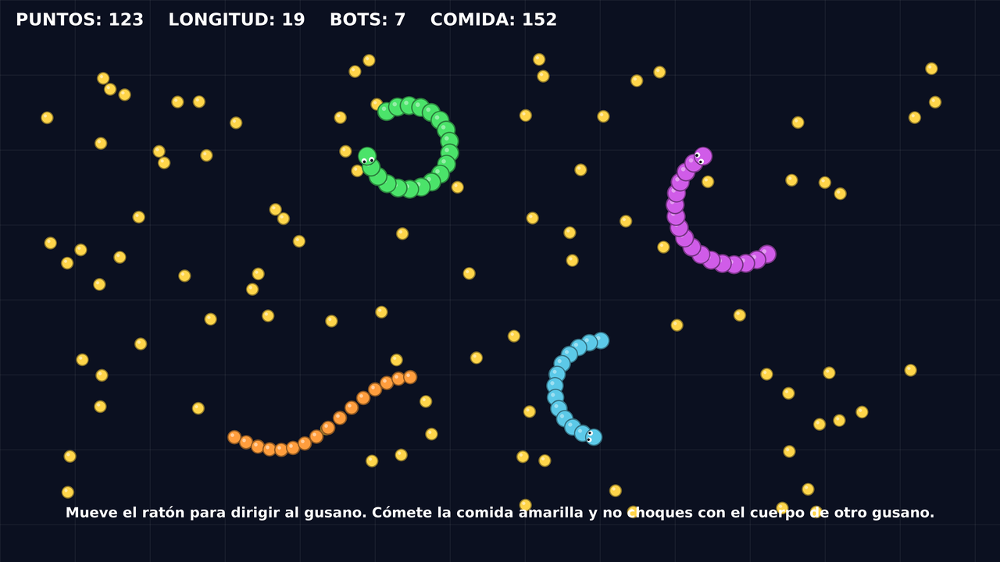

# 🐛 Slither 2D — Prototipo (Godot 4.7 / GDScript)

Prototipo 2D tipo [slither.io](http://slither.io) dentro de un espacio "infinito":

* La cabeza sigue suavemente el ratón y el cuerpo es una cadena de segmentos que
  recorre exactamente el camino de la cabeza, con separación fija.
* Al comer, el gusano suma puntos y añade un segmento al final de la cola.
* Si la cabeza toca el cuerpo de **otro** gusano, ese gusano muere al instante
  (vale para el jugador y para los bots).
* Al morir, el cuerpo se convierte en comida, dejando un nodo de comida en la
  posición **exacta** de cada segmento.
* Sin ningún asset gráfico: todo se dibuja con `_draw()` (fácil de cambiar por sprites).

---

## ▶️ Cómo abrirlo

1. Abre Godot 4.7 → **Importar** → selecciona esta carpeta
   (`slither_2d/project.godot`).
2. Pulsa **F5** (la escena principal ya está configurada: `escenas/Main.tscn`).
3. Mueve el ratón para dirigir al gusano y pulsa **SHIFT** (o el botón derecho)
   para el **TURBO**. Cuando mueras, **ESPACIO** o clic para reiniciar.

Controles: **ratón** = dirigir · **SHIFT / clic derecho** = turbo · **ESPACIO / clic** =
reiniciar · **M** = silencio · **N** = música (normal → bajita → apagada) ·
**P** = paleta de color · **O** = patrón del cuerpo (las pieles que tengas desbloqueadas).

> 🔉 **El juego suena, y no hay ni un archivo de audio**: los efectos y la música se
> generan por código (`scripts/sonido.gd`). Ver "Sonido" más abajo.

> 🛠️ **¿Vas a editarlo desde VS Code y subir cambios a GitHub?**
> Tienes la guía paso a paso, con los comandos y las tareas ya preparadas, en
> **[COMO_TRABAJAR.md](COMO_TRABAJAR.md)**. Importante: abre la carpeta
> `slither_2d` en VS Code (no la raíz del repo), porque en el repositorio hay
> dos `project.godot` y la extensión de Godot se quedaría con el de la raíz.

> Este proyecto es independiente del proyecto Godot que hay en la raíz de este
> repositorio: tiene su propio `project.godot`, así que se abre directamente
> apuntando a la carpeta `slither_2d`.

### ✅ Comprobar que todo funciona

Prueba automática de las 19 comprobaciones (sin abrir ventana, unos segundos):
primero que los scripts cargan, y después las mecánicas una por una.

```bash
cd slither_2d
bash herramientas.sh todo      # sincroniza + importa + prueba  (atajo recomendado)
# (equivale a ./herramientas.sh todo; también existe un lanzador en la raíz del repo)

# o solo la prueba, a mano:
godot --headless res://tests/PruebaMecanicas.tscn   # código de salida: 0 = todo bien
```

`herramientas.sh` tiene más atajos: `probar`, `jugar`, `editar`, `estado`,
`subir "mensaje"` y `todo`. Sin argumentos muestra la ayuda.

---

## 📁 Estructura

```
slither_2d/
├── project.godot
├── icon.svg
├── escenas/
│   ├── Main.tscn          Escena principal (mundo + HUD)
│   ├── Gusano.tscn        Gusano jugador (la cabeza es la raíz)
│   ├── GusanoCPU.tscn     Escena HEREDADA de Gusano.tscn con el script de bot
│   ├── Segmento.tscn      Un segmento del cuerpo
│   └── Comida.tscn        Una bola de comida
├── scripts/
│   ├── gusano.gd            ⭐ mecánicas 1, 2, 3 y 4 (movimiento, crecimiento, muerte, restos)
│   ├── cuerpo_segmento.gd   ⭐ un segmento del cuerpo
│   ├── comida.gd            ⭐ la comida
│   ├── gusano_cpu.gd        IA de los bots (hereda de Gusano)
│   ├── main.gd              mundo: spawnea comida/bots, HUD y reinicio
│   ├── dibujo.gd            utilidad de dibujo (círculos con borde suave)
│   └── fondo.gd             cuadrícula infinita de fondo
├── tests/
│   ├── PruebaMecanicas.tscn  Escena de la prueba automática
│   └── prueba_mecanicas.gd   Comprueba las 4 mecánicas en 7 pasos
├── herramientas.sh        Atajos de terminal (sync, probar, jugar, subir...)
└── .vscode/               Ajustes y 18 tareas listas para VS Code
└── preview/               capturas simuladas del aspecto (no hacen falta para jugar)
    ├── aspecto.png
    ├── detalle_bordes.png
    └── render.py          script de Python que genera esas imágenes
```



---

## 🧩 ¿A qué nodo se adjunta cada script?

| Script | Nodo de Godot | Dónde |
|---|---|---|
| `gusano.gd` | **`Node2D`** (raíz de la escena) | `escenas/Gusano.tscn` |
| `cuerpo_segmento.gd` | **`Area2D`** (raíz de la escena) + un `CollisionShape2D` con `CircleShape2D` como hijo | `escenas/Segmento.tscn` |
| `comida.gd` | **`Area2D`** (raíz de la escena) + un `CollisionShape2D` con `CircleShape2D` como hijo | `escenas/Comida.tscn` |
| `gusano_cpu.gd` | **`Node2D`** raíz de `GusanoCPU.tscn` (escena heredada de `Gusano.tscn`) | `escenas/GusanoCPU.tscn` |
| `main.gd` | **`Node2D`** raíz | `escenas/Main.tscn` |
| `fondo.gd` | **`Node2D`** hijo de Main | `escenas/Main.tscn` |
| `minimapa.gd` | **`Control`** hijo de `HUD` | `escenas/Main.tscn` |
| `sonido.gd` | **`Node2D`** hijo de Main (crea sus propios reproductores) | `escenas/Main.tscn` |
| `pieles.gd` | *a ningún nodo*: catálogo de paletas/patrones y logros (utilidades estáticas) | — |
| `records.gd` | *a ningún nodo*: récord, estadísticas y apodo en `user://records.cfg` | — |
| `dibujo.gd` | *a ningún nodo*: es una clase de utilidades estáticas (`Dibujo.disco(...)`) | — |

Árbol de `Gusano.tscn`:

```
Gusano            -> Node2D   (gusano.gd)     ← la cabeza ES este nodo
├── Cabeza        -> Area2D   (solo la forma de colisión de la cabeza)
│   └── CollisionShape2D      (CircleShape2D, radio 12)
└── Segmentos     -> Node2D   (contenedor vacío; aquí el script añade los segmentos)
```

> La cabeza es el propio `Node2D` raíz: por eso `global_position` del gusano
> **es** la posición de la cabeza, y `Cabeza` (Area2D) solo aporta la forma de
> colisión que detecta comida y cuerpos ajenos.

---

## 🔵🟢 Capas de colisión (¡lo más importante del proyecto!)

En `Proyecto → Ajustes del proyecto → Layer Names → 2D Physics`:

| Capa | Nombre | Quién la usa |
|---|---|---|
| 1 | `Cabeza` | El Area2D `Cabeza` de cada gusano (solo layer, nadie la detecta) |
| 2 | `Cuerpo` | Cada segmento (`Segmento.tscn`) — es **detectable**, no detecta |
| 3 | `Comida` | Cada comida (`Comida.tscn`) — es **detectable**, no detecta |

| Nodo | collision_layer | collision_mask | monitoring | monitorable |
|---|---|---|---|---|
| `Cabeza` (Area2D) | 1 | **6** (capa 2 + capa 3) | ✅ ON | ❌ OFF |
| `Segmento` (Area2D) | **2** | 0 | ❌ OFF | ✅ ON |
| `Comida` (Area2D) | **4** | 0 | ❌ OFF | ✅ ON |

Así solo las cabezas "escuchan" (una por gusano) y los 60 segmentos de cada
gusano no gastan CPU detectando nada. Si añades una capa nueva, actualiza la
`collision_mask` de `Cabeza` (los bits son potencias de 2: capa 2 = 2, capa 3 = 4).

---

## ⚙️ Cómo funciona cada mecánica

### 1) Movimiento del jugador (`gusano.gd`)

```gdscript
func _direccion_deseada() -> Vector2:
	return global_position.direction_to(get_global_mouse_position())

func _girar(delta: float) -> void:
	var deseada := _direccion_deseada()
	var diferencia := angle_difference(direccion.angle(), deseada.angle())
	var paso_maximo := velocidad_giro * delta
	direccion = direccion.rotated(clampf(diferencia, -paso_maximo, paso_maximo))
```

El gusano avanza **siempre a la misma velocidad** y gira como máximo
`velocidad_giro` radianes por segundo hacia el ratón: eso produce el giro suave
característico (nunca gira en seco). `angle_difference()` es Godot 4 (4.2+).

**El cuerpo:** la cabeza guarda su recorrido en `_ruta` (un punto cada 4 px) y
cada segmento se coloca sobre ese camino a una distancia fija:

```gdscript
func _colocar_segmentos() -> void:
	for i in _segmentos.size():
		_segmentos[i].global_position = _punto_detras((float(i) + 1.0) * separacion)
```

Con esto el cuerpo sigue *exactamente* la huella de la cabeza y la separación
nunca se deforma (a diferencia del típico "cada segmento persigue al anterior",
que se "encoje" en las curvas).

### 2) Crecimiento (`comida.gd` + `gusano.gd`)

La comida es un `Area2D` en el grupo `comida`. La cabeza (Area2D con
`monitoring = ON`) recibe la señal `area_entered`:

```gdscript
func _on_cabeza_area_entered(area: Area2D) -> void:
	if area.is_in_group(Comida.GRUPO):
		_comer(area as Comida)
	elif area.is_in_group(CuerpoSegmento.GRUPO):
		_chocar_con_cuerpo(area as CuerpoSegmento)

func _comer(comida: Comida) -> void:
	puntuacion += comida.valor          # suma puntos
	crecer(comida.segmentos)            # añade segmento(s) al FINAL de la cola
	puntuacion_cambiada.emit(puntuacion, longitud())
	comida.consumir()                   # pop + queue_free()
```

`crecer()` añade el segmento nuevo al final del array `_segmentos` (o sea, la cola)
y lo coloca en la ruta. La comida otorga `valor` puntos y `segmentos` segmentos.

### 3) Muerte por choque contra otro cuerpo

```gdscript
func _chocar_con_cuerpo(segmento: CuerpoSegmento) -> void:
	if _tiempo_inmunidad > 0.0:
		return
	var otro := segmento.dueno          # cada segmento sabe de qué gusano es
	if otro == self or not is_instance_valid(otro):
		return                          # tu propio cuerpo NO te mata
	morir()
```

Es el mismo script para el jugador y para los bots. `_tiempo_inmunidad` (2 s)
evita muertes absurdas justo al aparecer.

### 4) Restos de comida al morir

```gdscript
func morir() -> void:
	...
	var posiciones := PackedVector2Array()
	posiciones.append(global_position)                    # la cabeza
	for segmento in _segmentos:
		posiciones.append(segmento.global_position)       # cada segmento
	murio.emit(posiciones)                                # avisa al mundo
	visible = false
	queue_free()
```

El gusano no sabe dónde vive la comida: **emite una señal** y `main.gd` la usa para
crear una comida naranja (3 puntos) en cada posición exacta:

```gdscript
func _esparcir_restos(posiciones: PackedVector2Array) -> void:
	for posicion in posiciones:
		_aparecer_comida(posicion, 3, 9.0, COLOR_RESTOS)
```

### 5) Turbo (`gusano.gd`)

Mientras se mantiene **SHIFT** (o el clic derecho), la cabeza corre a
`velocidad * velocidad_turbo` (1.7x) y **el cuerpo paga el precio**: cada
`intervalo_costo_turbo` (0.35 s) se suelta el último segmento, que aparece en el
suelo como comida amarilla, así que se puede recuperar. Si la longitud baja a
`segmentos_minimos_turbo` (6), el turbo se desactiva solo: nunca te quedas sin cuerpo.

La barra verde del HUD (abajo a la izquierda) es el "depósito": se vacía a medida
que gastas segmentos. La acción `turbo` se crea por código en `main.gd`
(`_asegurar_accion_turbo()`), así puedes añadir más teclas desde
**Proyecto → Ajustes → Mapa de entrada** sin tocar el código.

### 6) Un solo grosor de cuerpo (`gusano.gd`)

Todo el cuerpo tiene **un solo grosor**: cada segmento usa exactamente el mismo
radio que la cabeza (`radio`, 12 px), así que el gusano es un tubo uniforme de la
cabeza a la cola. Los grosores se aplican con `_radio_de_segmento()` /
`_actualizar_grosores()`, y solo se recalculan cuando cambia el número de segmentos
(no en cada frame).

> 🎛️ El **afilado de cola** sigue en el código como opción desactivada: pon
> `Gusano → Cuerpo → cola_afilada_segmentos` en 8 (y `grosor_cola` a tu gusto,
> 0.55 = 55 % del radio en la punta) y volverás a tener la cola fina. Se aplica al
> empezar la siguiente partida (o al comer el siguiente segmento).

### 7) Power-ups (`comida.gd` + `gusano.gd`)

Cada `intervalo_powerup` (18 s) aparece uno (como máximo `max_powerups` = 3 en el
mundo). Son comidas normales con un **aro** de su color y **no engordan**: dan un
efecto temporal (se acumula quedándose con el mayor):

| Power-up | Color | Duración | Efecto |
|---|---|---|---|
| **IMÁN** | cian | 6 s | Atrae la comida a menos de `radio_iman` (260 px) hacia la cabeza |
| **ESCUDO** | verde claro | 5 s | No puedes morir al chocar con otro cuerpo |
| **TURBO** | rosa | 4 s | Turbo gratis: corre rápido **sin** perder longitud |
| **FANTASMA** | lila | 5 s | Ni mueres ni te ven: el cuerpo se vuelve translúcido |

El HUD (abajo a la izquierda) muestra qué efectos tienes activos y cuántos segundos
les quedan.

### 8) Minimapa (`minimapa.gd`)

El `Control` de la esquina superior derecha dibuja, alrededor del jugador (que va
en el centro), los gusanos con su color (el jugador con un aro blanco), la comida,
los restos en naranja y los power-ups. `escala` (0.032) y `alcance` (2600 px)
deciden cuánto mundo entra en el cuadro.

### 9) Marcador de los más largos (`main.gd`)

Arriba en el centro: **TOP 5** de gusanos ordenados por longitud (`sort_custom`),
con **TÚ** marcado con una estrella, más el **récord** de la partida. Se refresca
cada `intervalo_clasificacion` (0.25 s), no en cada frame.

### 10) Sonido (`sonido.gd`) — generado por código

**No hay ni un `.wav`/`.mp3` en el proyecto**: igual que el juego dibuja con `_draw()`,
el audio se construye a mano. Se rellena un `PackedByteArray` con muestras PCM
(16 bits, 22.050 Hz, mono) y se envuelve en un **`AudioStreamWAV`** (¡en Godot 4 ese es
el nombre!; `AudioStreamSample` era de Godot 3). Cada efecto es un barrido de frecuencia
con envolvente percusiva: 3 ms de ataque y caída hasta cero para que no se oiga ningún
"clic" al empezar ni al terminar.

| Sonido | Cuándo | Cómo está hecho |
|---|---|---|
| **Comer** | Al tragar comida | Seno 520 → 780 Hz, 0,07 s. Sube en **escalera** si comes varias seguidas (<1,2 s): hasta medio tono por comida |
| **Power-up** | Al coger un power-up | Arpegio triangular 660 → 880 → 1320 Hz |
| **Turbo (arranque)** | Al empezar a correr | Barrido 300 → 900 Hz de onda cuadrada |
| **Turbo (zumbido)** | Mientras dura el turbo | Bucle de 0,25 s con trémolo, pegado al gusano (lo corta al soltar) |
| **Muerte** | Cuando muere un gusano | Barrido 440 → 90 Hz + ruido, 0,5 s. El del jugador es grave y fuerte; el de un bot, más agudo, flojo y atenuado por la distancia |
| **Fin de partida** | Al salir la pantalla de "¡TE HAN COMIDO!" | Golpe grave 220 → 60 Hz |
| **Partida nueva** | Al reiniciar | Arpegio ascendente (Do-Mi-Sol-Do) |
| **Música** | Todo el rato | Bucle chiptune de 7,5 s a 128 BPM con melodía (cuadrada), bajo (triangular) y bombo, generado nota a nota |

Detalles pensados a propósito:

* **Posicional**: los efectos usan `AudioStreamPlayer2D`, así que una muerte a tu derecha
  suena a la derecha y lo que pasa lejos se oye flojo (`distancia_audible`, 900 px).
* **Pool de 6 voces**: comer mientras suena el power-up no se corta; la voz libre se
  reutiliza y, si no hay ninguna, se pisa la más antigua.
* **Nunca igual**: cada reproducción lleva un `pitch_scale` aleatorio de ±3 %.
* **Sin "tac" en los bucles**: la frecuencia del zumbido y el trémolo se ajustan para que
  quepan **ciclos enteros** dentro del bucle (221 y 2 ciclos exactos), así el final enlaza
  con el principio.
* **Teclas**: **M** silencia todo (bus Master) y **N** baja/apaga la música. La preferencia
  se guarda en `user://ajustes.cfg` (con `ConfigFile`), o sea en tu perfil de usuario, **no
  en el repositorio**. El estado se ve abajo a la derecha del HUD.
> 👀 Puedes **ver** las ondas de los 8 sonidos en `preview/sonidos.png` (se generan,
> sin abrir Godot, con `python3 preview/render_sonidos.py`: replica las mismas fórmulas).

* **Ajustes**: `Sonido → volumen_efectos`, `volumen_musica`, `volumen_musica_bajita`
  y `distancia_audible`. El número de voces simultáneas es la constante `VOCES` (6)
  del script `sonido.gd`.

### 11) Pieles: paletas, patrones y logros (`pieles.gd`)

Una **piel** = una paleta de 3 colores + un patrón que decide el color de cada
segmento. Como todo lo demás del proyecto, se calcula por código (nada de imágenes):

| Patrón | Qué hace |
|---|---|
| **Liso** | Todo el cuerpo del color base |
| **Rayas** | Un segmento sí y otro no, en el color claro |
| **Anillos** | Cada 3 segmentos, uno oscuro |
| **Degradado** | Del color base al oscuro a lo largo del cuerpo |
| **Motas** | Manchas repartidas con un ruido **estable** (siempre en el mismo sitio) |
| **Bicolor** | Mitad del cuerpo de un color y mitad de otro |

**Teclas**: **P** pasa a la siguiente paleta desbloqueada y **O** al siguiente patrón
(se aplican al momento y se guardan). Los **bots** también llevan piel al azar: cada
partida se ve distinta. El color de la cabeza (y el del minimapa) es el primer color
de la paleta.

Las pieles se **desbloquean con logros** (8C), que se miran contra tus estadísticas
guardadas:

| Piel | Cómo se consigue |
|---|---|
| Clásico, Liso y Rayas | de serie |
| Neón | Cómete 25 comidas |
| Anillos | Cómete 50 comidas |
| Hielo | Llega a 25 de longitud |
| Degradado | Llega a 40 de longitud |
| Motas | Cómete 3 bots |
| Fuego | Cómete 5 bots |
| Selva | Juega 10 partidas |
| Bicolor | Juega 15 partidas |
| Oro | Haz 300 puntos |

Cuando desbloqueas algo, sale un aviso en el HUD al morir y suena un arpegio. Al
pasar por encima de una piel bloqueada con P, `Pieles.requisito()` te dice qué falta.

### 12) Récord, estadísticas y apodo (`records.gd`)

Todo esto **se recuerda entre partidas** en `user://records.cfg` (con `ConfigFile`;
está en tu perfil de Godot, no en el repositorio, así que puedes editarlo o borrarlo
sin miedo):

* **Récord de puntos y de longitud** ("Mejor: ..." en el HUD) y **"¡NUEVO RÉCORD!"**
  cuando superas tu marca al morir.
* **Estadísticas**: partidas jugadas, comida total, bots comidos y tiempo jugado.
* **Top 5 de tus mejores partidas** (puntos, longitud y fecha), en la pantalla final,
  estilo arcade.
* **Tu apodo**: por defecto el usuario de tu sistema; se cambia escribiéndolo en la
  pantalla de muerte (campo "Tu apodo:") y sale en la tabla de mejores partidas.

> 💡 El archivo se llama `records.cfg` y está en
> `~/.local/share/godot/app_userdata/<proyecto>/`. Borrarlo = empezar de cero.

---

## 🤖 Bots (`gusano_cpu.gd`)

`GusanoCPU.tscn` es una **escena heredada** de `Gusano.tscn` que solo cambia el
script; el bot hereda todo el movimiento, el cuerpo, la muerte y los restos, y
únicamente sobreescribe *hacia dónde quiere ir*:

```gdscript
func _direccion_deseada() -> Vector2:
	return _direccion_ia
```

Su IA (toma una decisión cada 0.15 s, no en cada frame):

1. Si se ha alejado más de `distancia_maxima_al_jugador` del jugador, vuelve hacia él
   (el jugador está en el grupo `jugador`; si no, en un mundo infinito los bots
   acabarían perdidos donde no hay comida).
2. Si tiene el cuerpo de otro gusano a menos de `margen_peligro` (80 px), huye
   mezclando el vector de huida con su dirección actual. Algunos bots (los que
   tienen `probabilidad_turbo` alto, sorteado al aparecer) usan el **turbo** para
   escapar, así que de vez en cuando verás a uno acelerar dejando comida atrás.
3. Si no, persigue la comida más cercana dentro de `distancia_vision`.
4. Si no ve nada, gira un poco al azar.

---

## 🔧 Ajustes rápidos (desde el inspector)

* **Velocidad**: `Gusano → Movimiento → velocidad`, o `Main → Gusanos → velocidad_jugador`.
* **Giro más o menos ágil**: `velocidad_giro` (rad/s). 6 es bastante ágil; 3 se siente "pesado".
* **Cuerpo más largo**: `segmentos_iniciales` y `segmentos_maximos`.
* **Cuerpo más apretado**: `separacion` (por defecto 15 px con radio 12).
* **Más/menos comida y bots**: `Main → Comida/Gusanos`.
* **Zoom de la cámara**: `Main → Camara → Zoom` (1.0 abre mucho campo de visión).
* **Bordes de los círculos**: casilla `bordes_suaves` en `Gusano` y en `Comida`
  (`true` = textura con borde suave, `false` = `draw_circle()` clásico).
* **Turbo más barato o más rápido**: `Gusano → Turbo → velocidad_turbo`,
  `intervalo_costo_turbo`, `segmentos_minimos_turbo`.
* **Grosor del cuerpo**: por defecto uniforme (igual que la cabeza). Para la
  cola afilada: `Gusano → Cuerpo → cola_afilada_segmentos` = 8 y ajusta `grosor_cola`.
* **Power-ups cada cuánto**: `Main → Power-ups → intervalo_powerup`, `max_powerups`
  y `powerups_activos` (ponlo en `false` para jugar sin ellos, como hace la prueba).
* **Tamaño del minimapa**: `Main → HUD → Minimapa → escala` y `alcance`.
* **Volumen del juego**: `Sonido → volumen_efectos` y `volumen_musica` (dB; -80 es mudo).
  También puedes bajar el volumen del canal en Ajustes del sistema, o pulsar **M**.
* **Alcance del audio 2D**: `Sonido → distancia_audible` (900 px).
* **Empezar de cero (récord y pieles)**: borra `records.cfg` (ver arriba).
* **Achicar los logros** (si tardan mucho): las cantidades están en `pieles.gd`,
  en el diccionario `logros` (por ejemplo `comida_25` → `cantidad: 25`).

---

## 🎨 Cambiar el dibujo por sprites

Los tres scripts dibujan círculos con `_draw()`. Si prefieres imágenes:

1. Añade un `Sprite2D` (con tu textura) como hijo del `Area2D`/`Node2D`.
2. Borra la función `_draw()` del script correspondiente.
3. Mantén el `CollisionShape2D` con un `CircleShape2D` del radio que quieras.

Para que la cabeza apunte hacia donde va (por ejemplo si usas un sprite con ojos),
puedes hacer `rotation = direccion.angle()` en el `_physics_process`.

---

## ⚠️ ¿Te sale el aviso `render_target_set_msaa: 2D MSAA is not yet supported for GLES3`?

Era un **aviso (W), no un error**, y ya no aparece porque lo hemos quitado de raíz:

* Venía del ajuste `rendering/anti_aliasing/quality/msaa_2d=2` del `project.godot`.
* El proyecto usa el renderizador **GL Compatibility** (para que funcione en GPUs
  integradas, móviles y web), y ahí Godot todavía no implementa MSAA 2D: ignora el
  ajuste y lo avisa por consola. Es decir, **ese MSAA nunca se aplicó** y la imagen
  se veía igual que sin él, así que quitar el ajuste no cambia nada visualmente.
* ¿Y por qué no se notaba el aliasing? Porque en vez de depender del MSAA, todos
  los círculos del juego (cabeza, segmentos y comida) se dibujan con una textura
  de borde degradado, que funciona en **cualquier** renderizador. Lo hace
  `Dibujo.disco()` en `scripts/dibujo.gd`, dibujando una textura de círculo con
  el alfa degradado en el borde (`antialiased` de `draw_circle()` sólo sirve para
  contornos: con `filled = true` Godot lo ignora).

Si prefieres el `draw_circle()` clásico, cada gusano y cada comida tiene la
casilla **`bordes_suaves`** en el inspector: ponla en `false` y listo.
Y si quieres MSAA 2D de verdad, cambia el renderizador a **Forward+**
(`Proyecto → Ajustes → Rendering → Renderer`) — con GL Compatibility no está soportado.

---

## ⚠️ Detalles de Godot 4 que se han tenido en cuenta

* `angle_difference()`, `get_global_mouse_position()`, `queue_redraw()`, `create_tween()`,
  `set_deferred()`, `await`, `@export_group`, `@onready` → todo API de Godot 4
  (nada de `rotation_degrees` como setter, `set_process`, `YSort`, `get_tree().call_group("...", "func")`
  ni otras cosas de Godot 3).
* Las propiedades de los nodos se asignan **antes** de `add_child()` cuando el
  script de ese nodo las aplica en `_ready()` (radio y color de los segmentos).
* Las formas de colisión se **duplican** (`shape.duplicate()`) para que cada
  instancia tenga el suyo; si no, todas compartirían el mismo recurso.
* Cambiar `monitoring`/`monitorable` dentro de una señal de física se hace con
  `set_deferred()`.
* `Image.create_empty()` + `ImageTexture.create_from_image()` (Godot 4.3+) para
  generar la textura del círculo con borde suave en `dibujo.gd`.
* Audio: `AudioStreamWAV` con `PackedByteArray.encode_s16()` (Godot 4; `AudioStreamSample`
  era de Godot 3), `AudioServer.set_bus_mute()` para el silencio y `ConfigFile` para
  recordar la preferencia en `user://`.

---

## 🚀 Ideas para seguir

Ya están hechas: turbo con coste de longitud, grosor uniforme del cuerpo,
power-ups (imán, escudo, turbo gratis y fantasma), minimapa y marcador TOP 5.

Pendientes (por orden de resultado/esfuerzo):

* **"Juice"**: partículas al comer y al morir, y un pequeño temblor de cámara.
* ~~Sonido~~ ✅ hecho: efectos **y música** generados por código (`scripts/sonido.gd`).
* ~~Pieles y estadísticas~~ ✅ hecho: paletas + patrones con desbloqueo por logros,
  récord y estadísticas que se recuerdan, top 5 de mejores partidas y apodo.
* **Bots con personalidad**: recolector, cazador (te persigue) y cobarde, elegidos
  en `_elegir_decision()`.
* **Segundo jugador local**: WASD en la misma pantalla y cámara dividida (o el
  mismo minimapa) para jugar con alguien.
* **Multijugador real**: sincronizar solo la cabeza y usar el mismo `_ruta` en los clientes.
